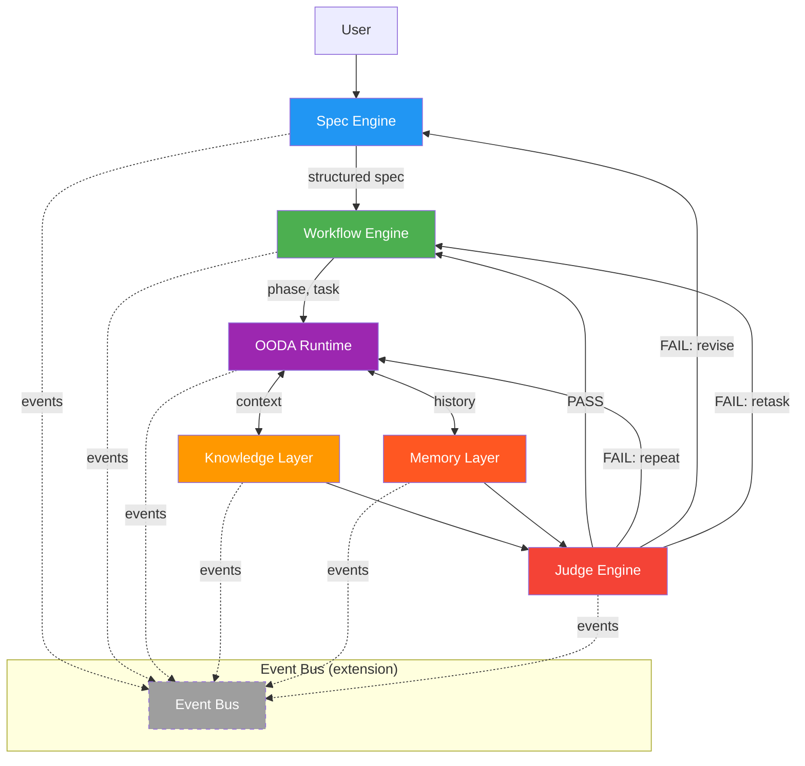

# CodeAI Platform — Core Runtime Architecture

**Status:** Fixed  
**Date:** 2026-07-11  
**Rule:** Архитектура заморожена. Изменения только через ADR.

---

## 1. Overview

CodeAI Platform состоит из 6 подсистем + Event Bus (extension point).



### Принципы

1. **Архитектура отделена от технологий.** Подсистемы определяются ответственностью, а не библиотеками.
2. **API между подсистемами стабильны.** Реализацию можно менять, не ломая контракты.
3. **Event Bus — extension point.** Не обязательно реализовывать сразу, но архитектура его предусматривает.
4. **Memory Layer отделена от Knowledge Layer.** Память — это не только знания, но и история, паттерны, контекст.

---

## 2. Subsystems

### 2.1 Spec Engine

**Ответственность:** Жизненный цикл спецификации — от промта пользователя до структурированного spec.

**API:**

```python
class SpecEngine:
    def generate(prompt: str) -> Path:
        """Сгенерировать goals.md из промта пользователя."""

    def validate(goals_path: Path) -> ValidationResult:
        """Валидировать структуру goals.md (F-XXX, AC-XXX, Data Models, API Contracts)."""

    def approve(goals_path: Path) -> None:
        """Human gate: записатьApproved: true в goals.md."""

    def parse(goals_path: Path) -> StructuredSpec:
        """Парсить goals.md в структурированный spec (F-XXX → requirements, AC-XXX → criteria)."""
```

**Input:** `prompt: str`  
**Output:** `StructuredSpec`

---

### 2.2 Workflow Engine

**Ответственность:** Управление состоянием пайплайна — фазы, задачи, transitions, invariants.

**API:**

```python
class WorkflowEngine:
    def start(phase: str) -> None:
        """Начать фазу."""

    def next() -> Phase | None:
        """Найти следующую готовую фазу (pending, deps completed)."""

    def complete(phase: str, judge_passed: bool) -> None:
        """Завершить фазу (требует judge_passed=true)."""

    def rollback(phase: str, reason: str) -> None:
        """Откатить фазу (по решению Judge Engine)."""
```

**Invariants:**

| ID | Правило |
|----|---------|
| INV1 | implement-spec-stage не может быть active без tasks |
| INV2 | write-tests не может начаться пока implement не completed |
| INV3 | completed phase требует все tasks completed |
| INV4 | pending phase не может иметь completed tasks |
| INV5 | task_cycle не может начаться пока decompose не completed |
| INV6 | complete не может наступить пока все phases не completed |

---

### 2.3 OODA Runtime

**Ответственность:** Выполнение observe/orient/decide/act cycle для каждой задачи.

**API:**

```python
class OODARuntime:
    def execute(task: Task) -> OODAResult:
        """Запустить OODA cycle для задачи."""

    def resume(task_id: UUID) -> OODAResult:
        """Возобновить прерванную задачу."""

    def interrupt(task_id: UUID) -> None:
        """Прервать выполняющуюся задачу."""
```

**Step Mappings:**

| Step | Agents | Output |
|------|--------|--------|
| analyst | @observe → @orient | architecture.md |
| dev | @decide → validate → @act | dev-summary.md |
| tester | @decide → validate → @act | tester-summary.md |

---

### 2.4 Knowledge Layer

**Ответственность:** Предоставление контекста для OODA agents. Пассивный слой — ничего не решает и не управляет.

**API:**

```python
class KnowledgeLayer:
    def search(query: str, scope: str = "all") -> list[Knowledge]:
        """Поиск по базе знаний (全文, semantic, title)."""

    def retrieve(context_type: KnowledgeType, params: dict[str, Any]) -> Context:
        """Получить контекст определённого типа (architecture, best_practice, reference)."""
```

**Внутренние компоненты:**

| Компонент | Ответственность |
|-----------|----------------|
| MCP | Протокол доступа к инструментам |
| Obsidian | Хранение и навигация по документам |
| OHS | Гибридный поиск (BM25 + fuzzy + vectors) |
| RAG | Retrieval Augmented Generation |
| GraphRAG | Граф связей между документами |
| Vector DB | Эмбеддинги для semantic search |
| Docs | Статьи, тезисы, стенограммы |

---

### 2.5 Memory Layer

**Ответственность:** Хранение истории, контекста и накопленных знаний. Отделена от Knowledge Layer, потому что память — это не только знания.

**API:**

```python
class MemoryLayer:
    def store(entry: MemoryEntry) -> None:
        """Сохранить запись в память."""

    def load(query: str, scope: str = "project") -> list[MemoryEntry]:
        """Загрузить записи из памяти по запросу."""

    def summarize(scope: str, depth: str = "brief") -> str:
        """Получить суммаризацию памяти (brief/detailed/full)."""
```

**Типы памяти:**

| Тип | Описание |
|-----|----------|
| project_history | История проекта (что было сделано) |
| judge_history | Предыдущие решения Judge Engine |
| iterations | Предыдущие итерации пайплайна |
| decisions | ADR и архитектурные решения |
| long_term | Long-term memory (факты, связи) |
| user_preferences | Предпочтения пользователя |
| learned_patterns | Выученные паттерны (успешные/неуспешные) |

---

### 2.6 Judge Engine

**Ответственность:** Оценка результатов и определение следующего шага.

**API:**

```python
class JudgeEngine:
    def evaluate(response: str, context: str, spec: str) -> Verdict:
        """Полная оценка: structural + semantic + rule-based."""

    def score(response: str, rubric: Rubric) -> Score:
        """Оценка по конкретному rubric."""

    def route(verdict: Verdict) -> RouteAction:
        """Определить следующий шаг: repeat / revise / retask / continue."""
```

**Внутренние judges:**

| Judge | Тип | Описание |
|-------|-----|----------|
| Structural Judge | Deterministic | F-XXX coverage, AC completeness |
| Semantic Judge | AI-based | IEEE 29148, custom rubrics |
| Rule Judge | Deterministic | Invariants, gate conditions |
| DeepEval Adapter | Optional | Интеграция с DeepEval (опционально) |
| Custom Rubrics | Configurable | Project-specific criteria |

**Verdict:**

```python
@dataclass
class Verdict:
    overall: str           # PASS | PASS_WITH_CONCERNS | FAIL
    scores: dict[str, float]  # {judge_name: score}
    failures: list[str]    # список причин FAIL
    confidence: float      # 0.0 - 1.0
```

**RouteAction:**

```python
@dataclass
class RouteAction:
    target: str            # "ooda" | "spec" | "workflow"
    reason: str            # описание причины
    task_id: str | None    # ID задачи (для retask)
    phase_id: str | None   # ID фазы (для rollback)
```

---

## 3. Event Bus (Extension Point)

**Статус:** Не реализуется сейчас. Архитектура предусматривает.

### События

| Событие | Источник | Описание |
|---------|----------|----------|
| `spec.generated` | Spec Engine | goals.md сгенерирован |
| `spec.validated` | Spec Engine | goals.md прошёл валидацию |
| `spec.approved` | Spec Engine | Human gate пройден |
| `workflow.started` | Workflow Engine | Фаза начата |
| `workflow.completed` | Workflow Engine | Фаза завершена |
| `workflow.rollback` | Workflow Engine | Фаза откачена |
| `task.started` | OODA Runtime | Задача начата |
| `task.interrupted` | OODA Runtime | Задача прервана |
| `task.completed` | OODA Runtime | Задача завершена |
| `knowledge.requested` | OODA Runtime | Запрос контекста |
| `knowledge.retrieved` | Knowledge Layer | Контекст получен |
| `memory.stored` | Memory Layer | Запись сохранена |
| `memory.loaded` | Memory Layer | Записи загружены |
| `judge.evaluated` | Judge Engine | Оценка выполнена |
| `judge.routed` | Judge Engine | Следующий шаг определён |

### Подписка (когда будет реализован)

```python
class EventBus:
    def subscribe(event: str, handler: Callable) -> None:
        """Подписаться на событие."""

    def publish(event: str, data: dict) -> None:
        """Опубликовать событие."""
```

---

## 4. Repository Pattern (Data Access Layer)

**Статус:** Интерфейсы определены. Реализации — по мере необходимости.

### Принцип

- Подсистемы **не работают** с файлами/БД напрямую
- Все доступ к данным — через **абстрактные репозитории**
- Реализации можно менять без изменения бизнес-логики

### Интерфейсы

```python
from abc import ABC, abstractmethod
from typing import TypeVar, Generic

T = TypeVar("T")

class Repository(ABC, Generic[T]):
    """Базовый репозиторий."""

    @abstractmethod
    def load(self) -> T | None:
        """Загрузить сущность."""

    @abstractmethod
    def save(self, entity: T) -> None:
        """Сохранить сущность."""

    @abstractmethod
    def delete(self) -> None:
        """Удалить сущность."""


class WorkflowRepository(Repository[WorkflowSnapshot]):
    """Репозиторий workflow состояния."""

    @abstractmethod
    def backup(self, label: str = "") -> str:
        """Создать бэкап."""

    @abstractmethod
    def restore(self, backup_id: str) -> WorkflowSnapshot:
        """Восстановить из бэкапа."""

    @abstractmethod
    def list_backups(self) -> list[dict]:
        """Список бэкапов."""


class MemoryRepository(Repository[list[MemoryEntry]]):
    """Репозиторий памяти."""

    @abstractmethod
    def query(self, scope: str = "project") -> list[MemoryEntry]:
        """Запрос записей по scope."""


class KnowledgeRepository(Repository[list[Knowledge]]):
    """Репозиторий знаний."""

    @abstractmethod
    def search(self, query: str, kind: str | None = None) -> list[Knowledge]:
        """Поиск по базе знаний."""
```

### Путь к файлам

```
scripts/core/repositories/
├── __init__.py
├── repository.py          # Базовый Repository[T]
├── workflow_repository.py # WorkflowRepository
├── memory_repository.py   # MemoryRepository
├── knowledge_repository.py# KnowledgeRepository
├── base.py                # (legacy) WorkflowRepository
└── json_repo.py           # (legacy) JsonWorkflowRepository
```

---

## 5. Interfaces Between Subsystems

### Request/Response Types

```python
from dataclasses import dataclass, field
from datetime import datetime
from pathlib import Path
from typing import Any
from uuid import UUID

from scripts.core.enums import (
    KnowledgeKind, KnowledgeType, MemoryType, PhaseStatus,
    Priority, RouteTarget, TaskStatus, VerdictStatus,
)

# === Spec Engine ===

@dataclass(frozen=True)
class Requirement:
    id: UUID
    title: str
    description: str
    priority: Priority
    dependencies: list[UUID] = field(default_factory=list)

@dataclass(frozen=True)
class AC:
    id: UUID
    requirement_id: UUID
    description: str
    verifiable: bool = True

@dataclass(frozen=True)
class DataModel:
    name: str
    fields: dict[str, str] = field(default_factory=dict)
    description: str = ""

@dataclass(frozen=True)
class APIContract:
    method: str
    path: str
    request: dict[str, Any] = field(default_factory=dict)
    response: dict[str, Any] = field(default_factory=dict)
    description: str = ""

@dataclass(frozen=True)
class Scope:
    included: list[str] = field(default_factory=list)
    excluded: list[str] = field(default_factory=list)

@dataclass
class StructuredSpec:
    requirements: list[Requirement]
    acceptance_criteria: list[AC]
    data_models: list[DataModel]
    api_contracts: list[APIContract]
    scope: Scope

@dataclass
class ValidationResult:
    valid: bool
    errors: list[str]
    warnings: list[str]

# === Workflow Engine ===

@dataclass
class Task:
    uuid: UUID
    title: str
    description: str = ""
    status: TaskStatus = TaskStatus.PENDING
    assigned_role: str = ""
    spec_ref: str = ""
    branch: str | None = None
    dependencies: list[UUID] = field(default_factory=list)

@dataclass
class Phase:
    id: str
    title: str
    description: str = ""
    status: PhaseStatus = PhaseStatus.PENDING
    depends_on: list[str] = field(default_factory=list)
    tasks: list[Task] = field(default_factory=list)
    judge_passed: bool = False

@dataclass
class WorkflowState:
    current_phase: Phase | None = None
    phases: list[Phase] = field(default_factory=list)
    current_task: Task | None = None
    started_at: datetime | None = None
    updated_at: datetime | None = None

# === OODA Runtime ===

@dataclass
class Artifact:
    name: str
    path: Path
    type: str
    checksum: str | None = None
    metadata: dict[str, Any] = field(default_factory=dict)

@dataclass
class OODAResult:
    task_id: UUID
    step: str
    success: bool
    outputs: list[Artifact] = field(default_factory=list)
    summary: str = ""

# === Knowledge Layer ===

@dataclass(frozen=True)
class Knowledge:
    id: UUID
    source: str
    kind: KnowledgeKind
    content: str
    score: float = 0.0
    metadata: dict[str, Any] = field(default_factory=dict)

@dataclass
class Context:
    context_type: KnowledgeType
    items: list[Knowledge]
    summary: str

# === Memory Layer ===

@dataclass
class MemoryEntry:
    id: UUID
    type: MemoryType
    content: str
    timestamp: datetime = field(default_factory=datetime.now)
    metadata: dict[str, Any] = field(default_factory=dict)

# === Judge Engine ===

@dataclass
class Verdict:
    overall: VerdictStatus
    scores: dict[str, float] = field(default_factory=dict)
    failures: list[str] = field(default_factory=list)
    confidence: float = 0.0

@dataclass
class Score:
    value: float
    breakdown: dict[str, float] = field(default_factory=dict)
    judge: str = ""

@dataclass
class RouteAction:
    target: RouteTarget
    reason: str = ""
    task_id: UUID | None = None
    phase_id: str | None = None

@dataclass
class Rubric:
    name: str
    criteria: list[RubricCriterion] = field(default_factory=list)

@dataclass(frozen=True)
class RubricCriterion:
    id: str
    label: str
    weight: int = 1
    scale: int = 5
    pass_threshold: int = 3
    critical: bool = False
```

### Error Handling

```python
class CodeAIError(Exception):
    """Base exception for all CodeAI errors."""
    pass

class SpecError(CodeAIError):
    """Spec Engine errors (validation, generation)."""
    pass

class WorkflowError(CodeAIError):
    """Workflow Engine errors (invariant violation, invalid transition)."""
    pass

class OODAError(CodeAIError):
    """OODA Runtime errors (agent failure, timeout)."""
    pass

class KnowledgeError(CodeAIError):
    """Knowledge Layer errors (search failure, MCP error)."""
    pass

class MemoryError(CodeAIError):
    """Memory Layer errors (storage failure, corruption)."""
    pass

class JudgeError(CodeAIError):
    """Judge Engine errors (evaluation failure, rubric not found)."""
    pass
```

---

## 6. Migration Notes

### Создаётся

| Файл | Содержание |
|------|------------|
| `docs/architecture/CORE_RUNTIME.md` | Этот документ |
| `docs/architecture/TECH_STACK.md` | Technology Stack |
| `scripts/core/__init__.py` | Package init |
| `scripts/core/types/` | Dataclass definitions (package) |
| `scripts/core/spec_engine.py` | Spec Engine stub |
| `scripts/core/workflow_engine.py` | Workflow Engine stub |
| `scripts/core/ooda_runtime.py` | OODA Runtime stub |
| `scripts/core/knowledge_layer.py` | Knowledge Layer stub |
| `scripts/core/memory_layer.py` | Memory Layer stub |
| `scripts/core/judge_engine.py` | Judge Engine stub |
| `scripts/core/event_bus.py` | Event Bus stub (extension) |
| `scripts/core/errors.py` | Exception hierarchy |

### Не трогается

| Файл | Причина |
|------|---------|
| `scripts/build-loop/*.sh` | Существующий pipeline |
| `scripts/workflow/*.sh` | Существующий OODA orchestration |
| `scripts/*.py` | Существующие скрипты |
| `.mcp.json` | Существующая интеграция |
| `AGENTS.md` | Существующая конфигурация |
| `scripts/build-loop/docs/` | База знаний |
| `scripts/build-loop/workflow-template/` | Существующий шаблон |
