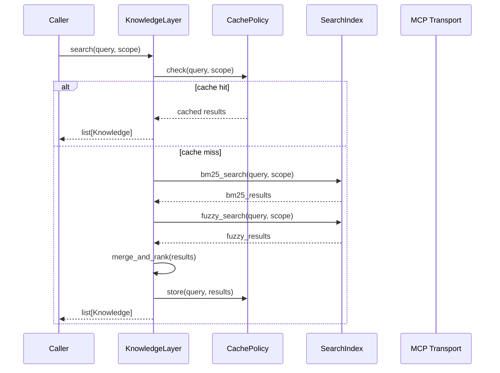
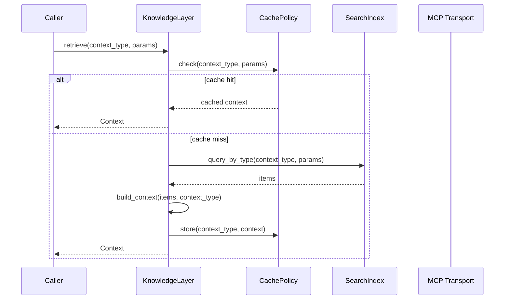
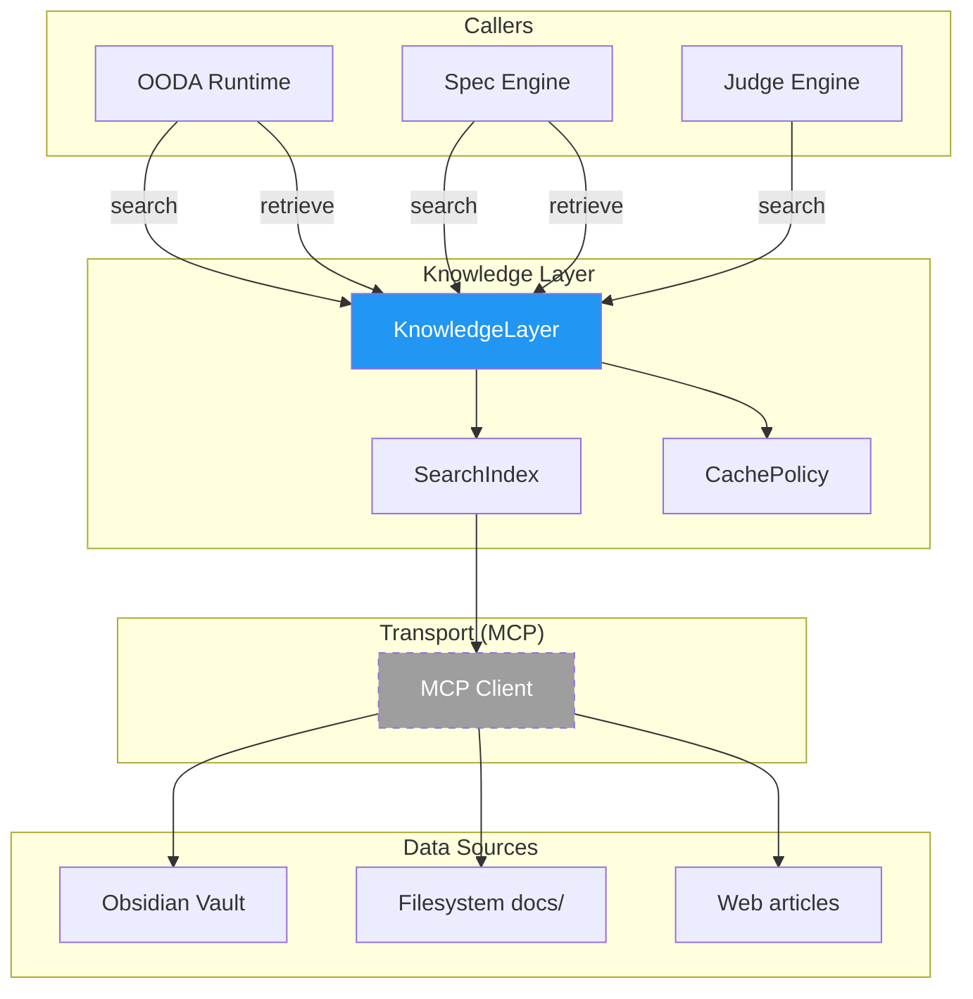

# KNOWLEDGE_LAYER_DESIGN.md

**Date:** 2026-07-13  
**Status:** Design  
**Supersedes:** CORE_RUNTIME.md §2.4  
**Last Reviewed:** 2026-07-13

---

## 1. Purpose

Knowledge Layer is a **passive** subsystem that provides context to other subsystems on demand. It stores, indexes, and retrieves domain knowledge — architecture docs, best practices, code references, API specs, articles, and patterns.

**Core value:** Any subsystem can ask "what do we know about X?" and get a structured, ranked answer without coupling to any specific storage technology, document format, or retrieval algorithm.

**Design principle:** Knowledge Layer has **zero business logic**. It does not decide, does not evaluate, does not orchestrate. It answers queries.

---

## 2. Boundaries

```
┌──────────────────────────────────────────────────────────┐
│                    Knowledge Layer                        │
│                                                          │
│  search()   ◄── OODA Runtime, Spec Engine, Judge Engine   │
│  retrieve() ◄── OODA Runtime, Spec Engine                │
│                                                          │
│  ┌──────────────┐  ┌──────────────┐  ┌───────────────┐  │
│  │ Knowledge    │  │ SearchIndex  │  │ CachePolicy   │  │
│  │ (data)       │  │ (retrieval)  │  │ (lifecycle)   │  │
│  └──────────────┘  └──────────────┘  └───────────────┘  │
│         │                │                  │            │
│  ┌──────┴───────────────┴──────────────────┴──────────┐ │
│  │              Transport Layer (MCP)                   │ │
│  └──────┬───────────────┬──────────────────┬──────────┘ │
└─────────┼───────────────┼──────────────────┼────────────┘
          │               │                  │
    ┌─────┴─────┐   ┌─────┴─────┐     ┌─────┴─────┐
    │ Obsidian  │   │ Filesystem│     │ Web / API │
    │ (vault)   │   │ (docs/)   │     │           │
    └───────────┘   └───────────┘     └───────────┘
```

### Dependency Direction

```
OODA Runtime ──► Knowledge Layer ──► MCP Transport
Spec Engine  ──► Knowledge Layer ──► Obsidian / FS / Web
Judge Engine ──► Knowledge Layer
```

Knowledge Layer **never** imports from: Workflow Engine, OODA Runtime, Spec Engine, Judge Engine, Memory Layer.

Knowledge Layer is **fully independent** — it has no dependencies on any other subsystem. Callers (OODA, Spec, Judge) provide all necessary context through the public API.

---

## 3. Responsibilities

### What Knowledge Layer DOES

| Responsibility | Description |
|----------------|-------------|
| Search knowledge | Find relevant knowledge items by text query |
| Retrieve context | Get structured context for a specific knowledge type |
| Index documents | Parse and index documents from various sources |
| Rank results | Score and sort results by relevance |
| Cache results | Avoid redundant retrieval for repeated queries |
| Hybrid search | Combine BM25, fuzzy, and semantic matching |
| MCP integration | Access external tools via Model Context Protocol |

### What Knowledge Layer DOES NOT DO

| Exclusion | Reason |
|-----------|--------|
| Business logic | OODA Runtime, Workflow Engine responsibility |
| Decision making | Judge Engine responsibility |
| State management | Workflow Engine responsibility |
| Memory storage | Memory Layer responsibility (independent subsystem) |
| Agent orchestration | OODA Runtime responsibility |
| File system access | Abstracted via MCP Transport |
| LLM-based generation | RAG provides context; generation is caller's job |
| Cross-subsystem integration | Callers (OODA, Spec) own integration logic |

---

## 4. What Knowledge Layer DOES (Detailed)

### 4.1 Ingestion

- Parse documents from Obsidian vault (Markdown, callouts, links)
- Parse filesystem docs (Markdown, plain text)
- Index code files (AST-optional — text-based indexing in v1)
- Normalize all content to a common `Knowledge` format

### 4.2 Indexing

- BM25 full-text index for keyword search
- Fuzzy matching index (Levenshtein distance)
- Semantic vector index (future — Vector DB)
- Metadata index (kind, source, tags)

### 4.3 Retrieval

- `search(query)` — find knowledge items matching a text query
- `retrieve(context_type)` — get all knowledge of a specific type
- Score results by relevance (text match + recency + source priority)
- Apply caching policy to avoid redundant work

### 4.4 Delivery

- Return `list[Knowledge]` from search
- Return `Context` from retrieve
- Never modify, filter, or evaluate content — raw delivery

---

## 5. Public API

Frozen API — matches CORE_RUNTIME.md §2.4 exactly. Changes only via ADR.

```python
class KnowledgeLayer:
    def search(query: str, scope: str = "all") -> list[Knowledge]:
        """Search knowledge base by text query.
        
        Performs hybrid search: BM25 + fuzzy matching.
        Returns results sorted by relevance score.
        
        Args:
            query: Text to search for.
            scope: Filter by scope ("all", "project", "global").
            
        Returns:
            List of matching Knowledge items, sorted by score desc.
        """

    def retrieve(
        self,
        context_type: KnowledgeType,
        params: dict[str, Any],
    ) -> Context:
        """Retrieve structured context for a specific knowledge type.
        
        Returns all knowledge of the given type, filtered by params.
        
        Args:
            context_type: Type of knowledge to retrieve.
            params: Filters (kind, source, after, before). Pass {} for no filters.
            
        Returns:
            Context with items and summary.
        """
```

### Method Signatures (frozen)

| Method | Input | Output | Errors |
|--------|-------|--------|--------|
| `search(query, scope)` | `str, str` | `list[Knowledge]` | `KnowledgeError` |
| `retrieve(context_type, params)` | `KnowledgeType, dict` | `Context` | `KnowledgeError` |

---

## 6. Knowledge Types

Defined in `scripts/core/enums.py::KnowledgeType` (already exists).

| Type | Description | Typical Source | Consumers |
|------|-------------|----------------|-----------|
| `architecture` | Architecture docs, ADRs, system design | Obsidian vault, docs/ | OODA @orient, Spec Engine |
| `best_practice` | Coding standards, patterns, guidelines | Obsidian vault, articles | OODA @act, Judge Engine |
| `reference` | API specs, library docs, tool references | Filesystem, MCP tools | OODA @act, Spec Engine |
| `tool` | Tool configurations, usage patterns | Config files, MCP | OODA @act |
| `pattern` | Reusable code patterns, templates | Codebase, articles | OODA @act, Spec Engine |

### KnowledgeItem Kinds

Defined in `scripts/core/enums.py::KnowledgeKind` (already exists).

| Kind | Description | Source |
|------|-------------|--------|
| `spec` | Specification document | docs/specs/ |
| `adr` | Architecture Decision Record | docs/adr/ |
| `code` | Source code file | scripts/ |
| `document` | Markdown document | Obsidian, docs/ |
| `article` | External article or reference | MCP tools |
| `test` | Test file | tests/ |
| `api` | API specification | docs/api/ |
| `memory` | Memory entry (indexed by caller) | Caller-provided |

---

## 7. MCP as Transport Layer

### 7.1 What is MCP

Model Context Protocol (MCP) is the standard interface for connecting to external tools and data sources. Knowledge Layer uses MCP as its **transport layer** — not as a business logic layer.

### 7.2 MCP Tools Used by Knowledge Layer

| Tool | Purpose | v1 Status |
|------|---------|-----------|
| `filesystem` | Read docs from project directory | ✅ Required |
| `obsidian` | Query Obsidian vault | ✅ Required |
| `web_search` | Search external articles | ✅ Required |
| `code_search` | Search codebase | ✅ Required |

### 7.3 MCP Integration Pattern

```
KnowledgeLayer
    ↓ calls
MCPClient (transport)
    ↓ protocol
MCP Server (obsidian, filesystem, web)
    ↓ returns
Raw content → Knowledge normalization → Index → Storage
```

Knowledge Layer **never** knows which MCP server it's talking to. It sends a request, gets raw content back, normalizes it.

### 7.4 MCP Error Handling

- MCP timeout → retry with backoff (max 2 retries)
- MCP unavailable → return empty results, log warning
- MCP malformed response → skip item, log warning
- All MCP errors are wrapped in `KnowledgeError`

---

## 8. Obsidian Integration

### 8.1 Why Obsidian

Obsidian is one of the data sources for Knowledge Layer, accessed via MCP transport. It provides:
- Markdown-native storage
- Bidirectional links between documents
- Tags and metadata via YAML frontmatter
- Graph view for document relationships
- Plugin ecosystem (including MCP server)

### 8.2 Obsidian MCP Server

The Obsidian MCP server exposes:
- `obsidian_search(query)` — search across vault
- `obsidian_read(path)` — read specific note
- `obsidian_list(directory)` — list notes in directory
- `obsidian_graph(path)` — get linked notes

### 8.3 Vault Structure

```
vault/
├── architecture/      # ADRs, system design
├── best-practices/    # Coding standards, patterns
├── references/        # API specs, tool docs
├── articles/          # External references
├── templates/         # Reusable templates
└── _index/            # Auto-generated index
```

### 8.4 Frontmatter Schema

```yaml
---
title: "Document Title"
kind: adr | spec | document | article
type: architecture | best_practice | reference | tool | pattern
tags: [tag1, tag2]
date: 2026-01-01
source: "obsidian://path/to/note"
---
```

Knowledge Layer parses frontmatter to populate `Knowledge.metadata`.

---

## 9. Hybrid Search (OHS — Obsidian Hybrid Search)

### 9.1 Search Pipeline

```
query
  ↓
┌─────────────┐
│ BM25 Search │ ← keyword matching
└──────┬──────┘
       │
┌──────┴──────┐
│ Fuzzy Match │ ← Levenshtein distance
└──────┬──────┘
       │
┌──────┴──────┐
│   Merge &   │ ← deduplicate, combine scores
│   Rank      │
└──────┬──────┘
       │
┌──────┴──────┐
│  Semantic   │ ← Vector similarity (v2)
│  (optional) │
└──────┬──────┘
       │
  ranked results
```

### 9.2 BM25 Full-Text Search

- Standard BM25 scoring (k1=1.5, b=0.75)
- Tokenization: lowercase, split on whitespace + punctuation
- Stop words: minimal set (English)
- Field boosting: title × 3, tags × 2, content × 1

### 9.3 Fuzzy Matching

- Levenshtein distance threshold: 2 characters
- Applied when BM25 returns < 5 results
- Useful for misspelled queries

### 9.4 Semantic Search (v2)

- Embedding model: sentence-transformers (all-MiniLM-L6-v2)
- Vector store: FAISS or ChromaDB
- Cosine similarity threshold: 0.7
- Falls back to BM25 if vector store unavailable

### 9.5 Score Combination

**v1 formula** (BM25 + fuzzy only):
```
final_score = BM25_score × 0.67 + fuzzy_score × 0.33
```

**v2 formula** (full hybrid with semantic):
```
final_score = BM25_score × 0.4 + fuzzy_score × 0.2 + semantic_score × 0.4
```

---

## 10. RAG Pipeline

### 10.1 What is RAG

Retrieval-Augmented Generation: provide retrieved context to an LLM for generation. Knowledge Layer provides the **retrieval** part. The **generation** is the caller's responsibility.

### 10.2 RAG Flow

```
Caller (OODA, Spec)
    ↓ sends query
Knowledge Layer
    ↓ search(query)
    ↓ retrieve(context_type)
    ↓ returns Context
Caller
    ↓ injects Context into prompt
    ↓ calls LLM
    ↓ gets generated response
```

Note: Callers who need memory context in addition to knowledge context should
call Memory Layer separately and combine results.

### 10.3 Context Window Management

- Max context items: 10 (configurable)
- Max total tokens: 4096 (configurable)
- Priority: higher score items first
- Truncation: content truncated to fit token budget

### 10.4 RAG Quality Signals

| Signal | Description |
|--------|-------------|
| Coverage | How many query terms appear in results |
| Relevance | Average score of returned items |
| Freshness | Recency of most recent item |
| Diversity | Number of distinct knowledge types represented |

These signals are computed internally for ranking. Callers receive the final `Context` with items and summary.

---

## 11. GraphRAG (Future — v2+)

### 11.1 What is GraphRAG

Graph-based Retrieval-Augmented Generation: uses a knowledge graph to understand relationships between documents and entities, enabling multi-hop reasoning.

### 11.2 When Needed

- Queries requiring traversal of document relationships
- "What documents reference X?" queries
- "What are the consequences of changing Y?" queries
- Cross-document dependency analysis

### 11.3 Implementation Strategy (v2)

1. Build knowledge graph from document links and metadata
2. Store in Graph DB (Neo4j) or in-memory graph
3. Graph traversal for multi-hop queries
4. Combine graph scores with BM25/semantic scores

### 11.4 v1 Fallback

In v1, GraphRAG is not implemented. The `retrieve()` method returns flat lists. Callers who need relationship-aware results can use `search()` with specific queries.

---

## 12. Relationship with Memory Layer

### 12.1 Independence

Knowledge Layer and Memory Layer are **independent subsystems** with no direct dependency between them.

```
Knowledge Layer                    Memory Layer
┌──────────────┐                  ┌──────────────┐
│              │                  │              │
│  search()    │                  │  store()     │
│  retrieve()  │                  │  load()      │
│              │                  │  summarize() │
└──────────────┘                  └──────────────┘
        ▲                                  ▲
        │                                  │
   OODA Runtime                      OODA Runtime
   Spec Engine                       Workflow Engine
   Judge Engine                      Judge Engine
```

### 12.2 How Callers Bridge the Gap

When a caller (e.g., OODA Runtime) needs both knowledge and memory context:

1. Call `knowledge_layer.search(query)` → get knowledge results
2. Call `memory_layer.load(query)` → get memory results
3. Combine results in the caller's context

This keeps both subsystems independent. The caller owns the integration logic.

### 12.3 Why No Direct Dependency

| Reason | Explanation |
|--------|-------------|
| Single Responsibility | KL retrieves knowledge; ML stores history. Different concerns. |
| Dependency Rule | Adding KL → ML creates a cross-subsystem coupling not in ADR-0001. |
| Testability | Independent subsystems are easier to test in isolation. |
| Replaceability | ML can be replaced without affecting KL, and vice versa. |

---

## 13. Caching Policy

### 13.1 Cache Layers

| Layer | Scope | TTL | Invalidation |
|-------|-------|-----|-------------|
| Query cache | Per query string | 5 minutes | TTL-based |
| Document cache | Per document path | 30 minutes | TTL-based |
| Index cache | Full index | 1 hour | TTL + on mutation |

### 13.2 Cache Key Format

```
query_cache:search:{scope}:{query_hash}
query_cache:retrieve:{context_type}:{params_hash}
doc_cache:{source}:{path_hash}
```

### 13.3 Cache Invalidation

| Trigger | Action |
|---------|--------|
| New document indexed | Invalidate doc_cache for that source |
| Document updated | Invalidate doc_cache + query_cache |
| Document deleted | Invalidate doc_cache + query_cache + rebuild index |
| TTL expired | Lazy eviction on next access |

### 13.4 Cache Size Limits

| Cache | Max Entries | Eviction |
|-------|-------------|----------|
| Query cache | 1000 | LRU |
| Document cache | 500 | LRU |
| Index cache | 1 | Full rebuild |

### 13.5 v1 Simplification

In v1, caching is **in-memory only** (Python dict with TTL). No Redis, no external cache. Cache is lost on restart — acceptable for v1 single-process architecture.

---

## 14. Result Ranking Policy

### 14.1 Ranking Factors

| Factor | Weight | Description |
|--------|--------|-------------|
| Text relevance | 0.4 | BM25 score (keyword match) |
| Recency | 0.2 | Days since last modified (newer = higher) |
| Source priority | 0.2 | docs/ > vault/ > articles/ |
| Type priority | 0.1 | spec > adr > code > document > article |
| Popularity | 0.1 | How often referenced by other docs |

### 14.2 Score Formula

```
score = (text_relevance × 0.4)
      + (recency_score × 0.2)
      + (source_priority × 0.2)
      + (type_priority × 0.1)
      + (popularity × 0.1)
```

### 14.3 Recency Score

```
recency_score = max(0, 1 - (days_since_modified / 365))
```

### 14.4 Source Priority

| Source | Score |
|--------|-------|
| docs/ | 1.0 |
| vault/architecture/ | 0.9 |
| vault/best-practices/ | 0.8 |
| vault/references/ | 0.7 |
| articles/ | 0.6 |

### 14.5 Type Priority

| Kind | Score |
|------|-------|
| spec | 1.0 |
| adr | 0.9 |
| code | 0.8 |
| document | 0.7 |
| article | 0.6 |
| test | 0.5 |
| api | 0.8 |
| memory | 0.5 |

---

## 15. Error Handling Policy

### 15.1 Error Types

| Code | Message Pattern | Recoverable | Context |
|------|----------------|-------------|---------|
| `KLG_SEARCH_FAILED` | "Search failed: {reason}" | True | query, cause |
| `KLG_RETRIEVE_FAILED` | "Retrieve failed: {reason}" | True | context_type, cause |
| `KLG_INDEX_FAILED` | "Index failed: {reason}" | True | source, cause |
| `KLG_MCP_TIMEOUT` | "MCP timeout: {tool}" | True | tool, retry_count |
| `KLG_MCP_UNAVAILABLE` | "MCP unavailable: {tool}" | True | tool |
| `KLG_MCP_MALFORMED` | "MCP malformed response: {tool}" | False | tool, response |
| `KLG_CACHE_ERROR` | "Cache error: {reason}" | True | operation |
| `KLG_INVALID_QUERY` | "Invalid query: {reason}" | False | field |

### 15.2 Retry Policy

| Operation | Max Retries | Backoff | Conditions |
|-----------|-------------|---------|------------|
| MCP call | 2 | Exponential (1s, 2s) | Timeout, 5xx |
| Index rebuild | 1 | Immediate | Corruption detected |
| Cache read | 0 | N/A | Fail silently, serve stale |

### 15.3 Graceful Degradation

| Failure | Behavior |
|---------|----------|
| MCP unavailable | Return results from cache/index only |
| Index corrupted | Rebuild from source documents |
| Cache unavailable | Skip caching, serve directly |

---

## 16. Invariants

| ID | Rule | Enforcement |
|----|------|-------------|
| KINV-1 | `search()` always returns a list (empty if no results) | Never returns None |
| KINV-2 | `retrieve()` always returns a Context (empty items if no data) | Never returns None |
| KINV-3 | Knowledge items have non-empty `source` field | Indexed on ingest |
| KINV-4 | Search scores are in range [0.0, 1.0] | Normalized after scoring |
| KINV-5 | Cached results are served within TTL | TTL check on read |
| KINV-6 | MCP errors are wrapped in KnowledgeError | All MCP calls wrapped |
| KINV-7 | `scope` must be "all", "project", or "global" | Validated on entry |

---

## 17. Sequence Diagram

### search()



### retrieve()



---

## 18. Mermaid Architecture Diagram



---

## 19. API Contracts

### Knowledge (frozen dataclass)

Source of truth: `scripts/core/types/knowledge.py`. See CORE_RUNTIME.md §5 for contract.

```python
@dataclass(frozen=True)
class Knowledge:
    id: UUID
    source: str           # file path or URL
    kind: KnowledgeKind   # spec, adr, code, document, article, test, api, memory
    content: str          # text content
    score: float = 0.0    # relevance score [0.0, 1.0]
    metadata: dict[str, Any] = field(default_factory=dict)
```

### Context

```python
@dataclass
class Context:
    context_type: KnowledgeType
    items: list[Knowledge]
    summary: str
```

### KnowledgeType (enum)

```python
class KnowledgeType(str, Enum):
    ARCHITECTURE = "architecture"
    BEST_PRACTICE = "best_practice"
    REFERENCE = "reference"
    TOOL = "tool"
    PATTERN = "pattern"
```

### KnowledgeKind (enum)

```python
class KnowledgeKind(str, Enum):
    SPEC = "spec"
    ADR = "adr"
    CODE = "code"
    DOCUMENT = "document"
    ARTICLE = "article"
    TEST = "test"
    API = "api"
    MEMORY = "memory"
```

### KnowledgeRepository (abstract)

Matches CORE_RUNTIME.md §4 exactly. Additional methods (store, delete, count)
are internal implementation details of concrete repositories, not part of the
public architectural contract.

```python
class KnowledgeRepository(Repository[list[Knowledge]]):
    @abstractmethod
    def search(self, query: str, kind: str | None = None) -> list[Knowledge]:
        """Search knowledge base."""
```

---

## 20. Extension Points

| Extension | When | Impact |
|-----------|------|--------|
| SQLite repository | v2 | Full-text search, concurrent access |
| Vector DB integration | v2 | Semantic search via embeddings |
| GraphRAG | v2 | Multi-hop reasoning |
| Obsidian MCP plugin | v1 | Native vault access |
| Custom MCP servers | v1 | Domain-specific tools |
| Event Bus integration | v2 | `knowledge.requested`, `knowledge.retrieved` events |
| LLM-based re-ranking | v3 | AI-powered result ranking |
| Multi-tenant scoping | v3 | Per-user knowledge isolation |

---

## 21. Future Backend Strategy

### v1 (Current)

- **Storage:** Markdown files in Obsidian vault + filesystem
- **Search:** BM25 + fuzzy matching (in-memory index)
- **Transport:** MCP (filesystem + obsidian servers)
- **Cache:** In-memory dict with TTL

### v2 (Next)

- **Storage:** + SQLite for structured indexing
- **Search:** + Semantic search (sentence-transformers + FAISS)
- **Transport:** + Custom MCP servers for domain-specific tools
- **Cache:** + Redis for distributed caching
- **Graph:** + Knowledge graph (Neo4j or in-memory)

### v3 (Future)

- **Storage:** + PostgreSQL with pgvector
- **Search:** + Hybrid BM25 + semantic + graph
- **Transport:** + gRPC for high-throughput scenarios
- **Cache:** + CDN for static knowledge
- **Graph:** + Full GraphRAG with multi-hop reasoning

### Migration Path

Each version is backward-compatible. v1 code works with v2 backends. New backends are added via ADR, never by breaking existing APIs.

---

## Self-Review Checklist

| Criterion | Status |
|-----------|--------|
| Matches CORE_RUNTIME.md §2.4 | ✓ search() and retrieve() match exactly |
| Matches frozen retrieve() signature | ✓ params: dict[str, Any] (required) |
| Matches frozen Context type | ✓ 3 fields, no metadata |
| KnowledgeRepository matches CORE_RUNTIME.md §4 | ✓ Only search() method |
| Follows Repository Pattern | ✓ KnowledgeRepository abstract |
| Uses unified error hierarchy | ✓ KnowledgeError(CodeAIError) |
| Invariants documented | ✓ KINV-1 through KINV-7 |
| No responsibility leaks | ✓ Exclusions explicitly listed |
| No dependency on Memory Layer | ✓ Fully independent subsystem |
| MCP as transport (not logic) | ✓ MCP is passthrough, not decision maker |
| No business logic | ✓ Pure retrieval and indexing |
| Extensible (SQLite, Vector, Graph) | ✓ Future backends documented |
| Hybrid search defined | ✓ BM25 + fuzzy + semantic (v2) |
| RAG pipeline defined | ✓ Retrieval only, generation is caller's job |
| Caching policy defined | ✓ Three layers with TTL |
| Error handling defined | ✓ All error codes documented |
| Sequence diagrams included | ✓ search() and retrieve() |
| Mermaid architecture diagram | ✓ Full diagram included |
| Scope validation | ✓ KINV-7 defined |
| Single Source of Truth | ✓ types/knowledge.py as primary |
