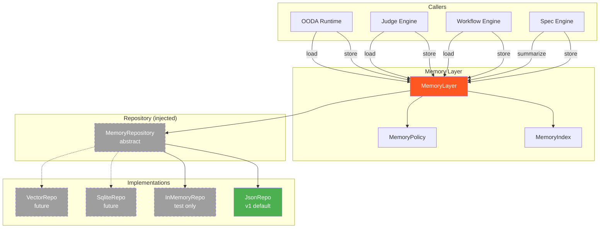
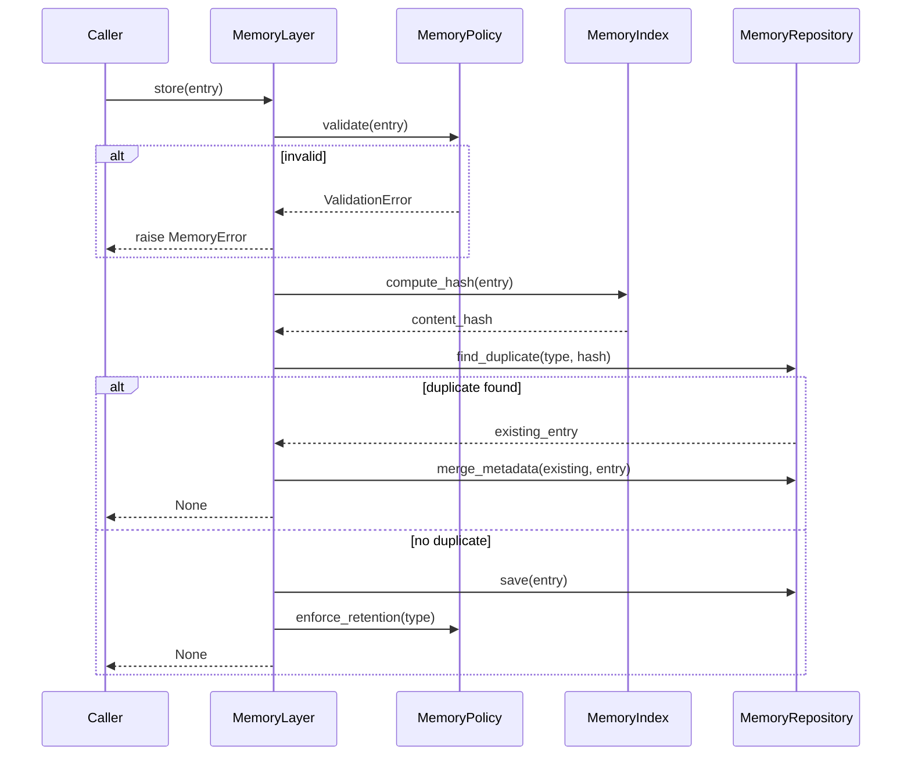
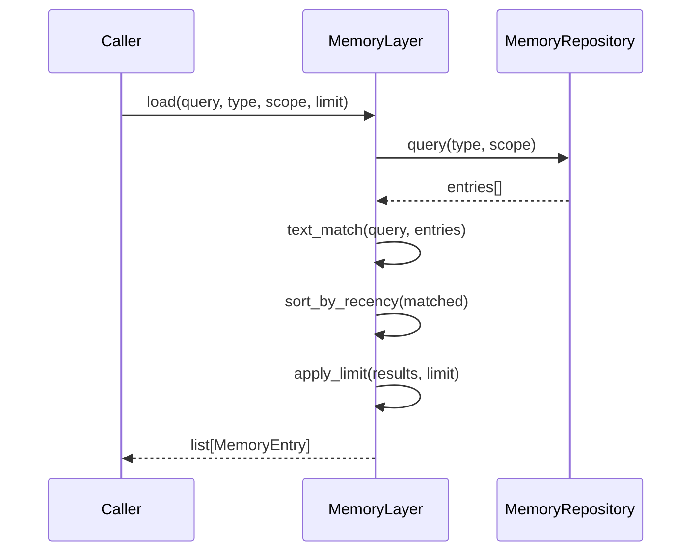
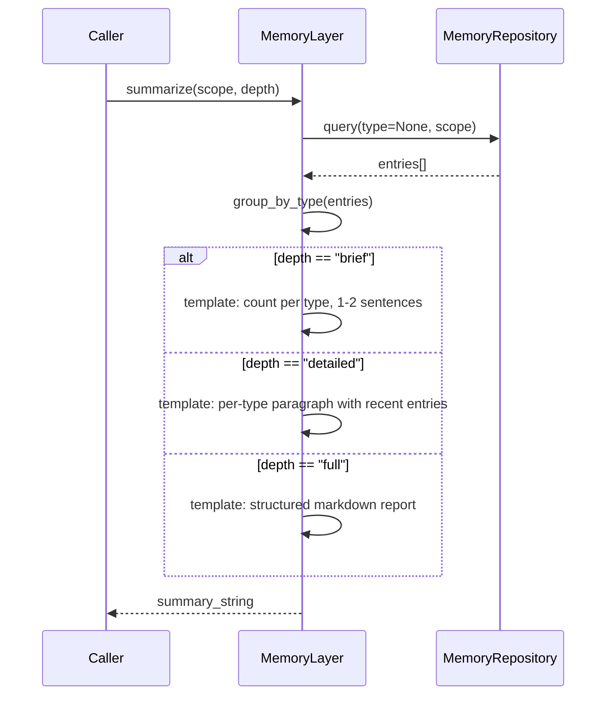

# MEMORY_LAYER_DESIGN.md

**Date:** 2026-07-13  
**Status:** Design  
**Supersedes:** CORE_RUNTIME.md §2.5  
**Last Reviewed:** 2026-07-13 (P1/P2 fixes applied)

---

## 1. Purpose

Memory Layer stores the platform's operational history, learned patterns, and accumulated context. It is **separate** from Knowledge Layer because memory is not only knowledge — it includes execution history, judge decisions, iteration traces, and user preferences that inform future behaviour without being "knowledge" in the document-retrieval sense.

**Core value:** Every subsystem can ask "what happened before?" and get a structured, typed answer without coupling to any specific storage technology.

---

## 2. Boundaries

```
┌─────────────────────────────────────────────────────────┐
│                    Memory Layer                         │
│                                                         │
│  store()  ◄── OODA, Judge, Workflow, Spec, Memory(self) │
│  load()   ──► OODA, Judge, Workflow, Spec               │
│  summarize() ► OODA, Judge, Spec (prompt construction)   │
│                                                         │
│  ┌─────────────┐  ┌──────────────┐  ┌───────────────┐  │
│  │ MemoryEntry │  │ MemoryIndex  │  │ MemoryPolicy  │  │
│  │ (data)      │  │ (retrieval)  │  │ (lifecycle)   │  │
│  └─────────────┘  └──────────────┘  └───────────────┘  │
└────────────────────────────┬────────────────────────────┘
                             │ Repository (injected)
                ┌────────────┴────────────┐
                │   MemoryRepository      │
                │   (abstract interface)  │
                └────────────┬────────────┘
                             │
              ┌──────────────┼──────────────┐
              │              │              │
         JsonRepo       SqliteRepo     VectorRepo
         (v1 default)   (future)       (future)
```

---

## 3. Responsibilities

### What Memory Layer DOES

| Responsibility | Description |
|----------------|-------------|
| Store entries | Persist `MemoryEntry` with type, content, metadata, timestamp |
| Load by query | Retrieve entries matching text query + type filter + scope |
| Summarize | Generate brief/detailed/full summary of stored entries |
| Deduplicate | Detect and merge duplicate entries on store |
| Enforce retention | Apply TTL and max-count policies per type |
| Scope isolation | Separate project-level from global-level entries |

### What Memory Layer DOES NOT DO

| Exclusion | Reason |
|-----------|--------|
| Semantic search over documents | Knowledge Layer responsibility |
| Code indexing | Knowledge Layer responsibility |
| Agent orchestration | OODA Runtime responsibility |
| State machine management | Workflow Engine responsibility |
| Evaluation / scoring | Judge Engine responsibility |
| File system access | Repository Pattern — abstracted away |
| Network calls | Repository Pattern — abstracted away |
| LLM-based summarization | v1 uses template-based only (see §4) |

---

## 4. External API

Frozen API — matches CORE_RUNTIME.md §2.5 exactly. Changes only via ADR.

```python
class MemoryLayer:
    def store(entry: MemoryEntry) -> None:
        """Store a memory entry.
        
        Assigns id (UUID) and timestamp to entry if not set.
        Deduplicates: if a duplicate exists (same type + content hash),
        merges metadata into existing entry.
        """

    def load(
        self,
        query: str,
        memory_type: MemoryType | None = None,
        scope: str = "project",
        limit: int = 50,
    ) -> list[MemoryEntry]:
        """Load entries matching query, filtered by type and scope.
        
        Returns entries sorted by relevance (text match) then recency.
        Limit caps result count (default 50, max 500).
        """

    def summarize(
        self,
        scope: str = "project",
        depth: str = "brief",
    ) -> str:
        """Summarize stored memory for the given scope.
        
        v1: Template-based summarization (no LLM).
        - "brief": count per type, 1-2 sentences
        - "detailed": per-type paragraph with recent entries
        - "full": structured markdown report with all entries
        """
```

### Method Signatures (frozen)

| Method | Input | Output | Errors |
|--------|-------|--------|--------|
| `store(entry)` | `MemoryEntry` | `None` | `MemoryError` |
| `load(query, memory_type, scope, limit)` | `str, MemoryType\|None, str, int` | `list[MemoryEntry]` | `MemoryError` |
| `summarize(scope, depth)` | `str, str` | `str` | `MemoryError` |

---

## 5. Memory Types

Defined in `scripts/core/enums.py::MemoryType` (already exists).

| Type | Description | Typical Store Trigger | Retention |
|------|-------------|----------------------|-----------|
| `project_history` | What was done (phase completions, task results) | Workflow Engine on phase complete | 90 days |
| `judge_history` | Previous Judge verdicts and scores | Judge Engine after evaluate() | 90 days |
| `iterations` | Pipeline iteration traces (full run summaries) | Workflow Engine on workflow complete | 30 days |
| `decisions` | ADR entries, architectural decisions | Spec Engine, manual | Permanent |
| `learned_patterns` | Successful/unsuccessful patterns | Judge Engine after pattern detected | 60 days |
| `long_term` | Persistent facts, relationships | Any subsystem | Permanent |
| `user_preferences` | User settings, preferred approaches | Manual, Spec Engine | Permanent |

---

## 6. Entry Lifecycle

```
  ┌───────┐     ┌────────┐     ┌──────────┐     ┌─────────┐
  │ Create │────►│ Store  │────►│ Active   │────►│ Expired │
  │        │     │        │     │ (queryable)│    │         │
  └───────┘     └────────┘     └──────────┘     └─────────┘
                     │               │                 │
                     │          ┌────▼─────┐     ┌────▼─────┐
                     │          │ Merged   │     │ Deleted  │
                     │          │ (dedup)  │     │ (gc)     │
                     │          └──────────┘     └──────────┘
                     │
                ┌────▼─────┐
                │ Rejected │
                │ (invalid)│
                └──────────┘
```

### States

| State | Description |
|-------|-------------|
| **Created** | Entry object constructed, not yet persisted |
| **Stored** | Persisted via MemoryRepository, queryable |
| **Active** | Within retention window, returned by load() |
| **Merged** | Duplicate detected, metadata merged into existing entry |
| **Expired** | Past TTL, eligible for garbage collection |
| **Deleted** | Removed by GC or manual purge |

---

## 7. Storage Policy

### Per-Type Limits

| Type | Max Entries | TTL | Max Content Length |
|------|-------------|-----|-------------------|
| `project_history` | 1000 | 90 days | 4096 chars |
| `judge_history` | 500 | 90 days | 2048 chars |
| `iterations` | 100 | 30 days | 8192 chars |
| `decisions` | Unlimited | Permanent | 8192 chars |
| `learned_patterns` | 200 | 60 days | 2048 chars |
| `long_term` | Unlimited | Permanent | 4096 chars |
| `user_preferences` | 50 | Permanent | 1024 chars |

### Scope Model

| Scope | Description | Visibility |
|-------|-------------|------------|
| `project` | Current project only | Local to project |
| `global` | Cross-project (user-level) | All projects |

Default scope: `"project"`.

---

## 8. Deletion Policy

### Automatic (Garbage Collection)

- Runs lazily — triggered when entry count exceeds threshold (100 over max for the type).
- Evicts entries past TTL, oldest first.
- Respects per-type max count: when exceeded, evicts oldest non-permanent entries.
- Permanent types (`decisions`, `long_term`, `user_preferences`) are never GC'd.

### Manual

- No explicit `delete()` in public API (not in CORE_RUNTIME.md).
- Future: `delete(entry_id)` can be added without breaking API.
- For now, subsystems can overwrite by storing a replacement entry.

---

## 9. Deduplication Policy

### Detection

On `store()`, before persisting:

1. Compute `content_hash = sha256(entry.content.lower().strip())`.
2. Query repository for existing entry with same `type` + `content_hash`.
3. If found: **merge** (do not create duplicate).

### Merge Rules

| Field | Action |
|-------|--------|
| `content` | Keep existing (unchanged) |
| `timestamp` | Keep existing (original) |
| `metadata` | Union: existing + new (new overrides on conflict) |
| `id` | Keep existing |
| `version` | Increment existing |

On merge, the existing entry is updated in-place. No new entry is created.

### Exceptions

- `iterations` type: never deduplicated (each iteration is unique).
- `project_history` with different `metadata["phase_id"]`: never deduplicated.

---

## 10. Search Policy

### Query Matching

`load(query, ...)` performs:

1. **Exact type filter** — if `memory_type` is provided, filter by type.
2. **Scope filter** — filter by scope (default: "project").
3. **Text matching** — case-insensitive substring match on `content`.
4. **Recency sort** — matching entries sorted by `timestamp` descending.
5. **Limit** — cap at `limit` entries (default 50, max 500).

### Future (not v1)

- Fuzzy matching (Levenshtein).
- Semantic search via Vector DB integration.
- Weighted scoring (type priority + recency + text relevance).

---

## 11. Storage Format

### JSON File (v1 default)

```python
class JsonMemoryRepository(MemoryRepository):
    """JSON file persistence. One file per project.
    Aligned with TECH_STACK.md: JSON + SQLite."""
    def __init__(self, path: Path):
        self._path = path  # e.g., .codeai/memory.json
```

### In-Memory (test only)

```python
class InMemoryMemoryRepository(MemoryRepository):
    """In-memory implementation. For unit tests only. No persistence."""
    def __init__(self):
        self._entries: list[MemoryEntry] = []
```

### SQLite (future)

```python
class SqliteMemoryRepository(MemoryRepository):
    """SQLite persistence. Full-text search, TTL index."""
    def __init__(self, db_path: Path):
        ...
```

### Vector DB (future)

```python
class VectorMemoryRepository(MemoryRepository):
    """Semantic search via embeddings."""
    def __init__(self, embedding_fn, vector_store):
        ...
```

---

## 12. Mermaid Diagram



---

## 13. Sequence Diagram

### store()



### load()



### summarize()



---

## 14. API Contract

### MemoryEntry (frozen dataclass)

Source of truth: `scripts/core/types/memory.py`

```python
@dataclass
class MemoryEntry(Serializable):
    """Single memory entry. Frozen contract — extend via ADR only."""
    id: UUID
    type: MemoryType
    content: str
    timestamp: datetime = field(default_factory=datetime.now)
    metadata: dict[str, Any] = field(default_factory=dict)
    scope: str = "project"
    content_hash: str = ""
    version: int = 1
```

### MemoryRepository (abstract)

```python
class MemoryRepository(ABC):
    @abstractmethod
    def save(self, entry: MemoryEntry) -> None: ...

    @abstractmethod
    def find_duplicate(self, memory_type: str, content_hash: str) -> MemoryEntry | None: ...

    @abstractmethod
    def query(self, memory_type: str | None, scope: str) -> list[MemoryEntry]: ...

    @abstractmethod
    def count(self, memory_type: str, scope: str) -> int: ...

    @abstractmethod
    def delete_expired(self, before: datetime) -> int: ...

    @abstractmethod
    def delete_oldest(self, memory_type: str, scope: str, count: int) -> int: ...
```

---

## 15. Invariants

| ID | Rule | Enforcement |
|----|------|-------------|
| MINV-1 | Every stored entry has a unique `id` (UUID) | `store()` assigns UUID |
| MINV-2 | `content_hash` is always SHA-256 of normalized content | `store()` computes before persist |
| MINV-3 | Duplicate entries (same type + hash) are merged, not duplicated | `store()` checks before save |
| MINV-4 | Entries with TTL are not returned by `load()` after expiry | `load()` filters expired entries |
| MINV-5 | Permanent types (`decisions`, `long_term`, `user_preferences`) are never GC'd | GC respects type policy |
| MINV-6 | `load()` limit is capped at 500 | `load()` clamps input |
| MINV-7 | `summarize()` never returns empty string for non-empty store | Returns "No entries found" placeholder |
| MINV-8 | `scope` must be "project" or "global" | `store()` validates before persist |

---

## 16. Error Handling

All errors inherit from `MemoryError(CodeAIError)`.

| Code | Message Pattern | Recoverable | Context |
|------|----------------|-------------|---------|
| `MEM_STORE_FAILED` | "Failed to store entry: {reason}" | True | entry type, cause |
| `MEM_LOAD_FAILED` | "Failed to load entries: {reason}" | True | query, scope, cause |
| `MEM_SUMMARIZE_FAILED` | "Failed to summarize: {reason}" | True | scope, cause |
| `MEM_INVALID_ENTRY` | "Invalid entry: {field} is missing/invalid" | False | field name |
| `MEM_REPOSITORY_ERROR` | "Repository error: {reason}" | True | operation, cause |

---

## 17. Future Extensions (post-v1)

| Extension | When | Impact |
|-----------|------|--------|
| SQLite repository | v2 | Full-text search, TTL index, concurrent access |
| Vector DB repository | v2 | Semantic search via embeddings |
| Embedding-based similarity | v2 | "Find similar memories" query type |
| Cross-project scope | v2 | Global memory across projects |
| Memory pruning API | v2 | Explicit `delete()` and `purge()` methods |
| Event emission | v2 | `memory.stored`, `memory.loaded` events |
| LLM-based summarize | v2 | AI-generated summaries replacing templates |
| Compression | v3 | Large content compression for storage efficiency |

---

## 18. File Structure (planned)

```
scripts/core/
├── memory_layer.py              # MemoryLayer class (public API)
├── memory/
│   ├── __init__.py
│   ├── policy.py                # MemoryPolicy (retention, limits)
│   └── index.py                 # MemoryIndex (hash, dedup, search)
├── types/
│   └── memory.py                # MemoryEntry (frozen contract)
├── repositories/
│   ├── memory_repository.py     # MemoryRepository ABC
│   ├── json_memory_repo.py      # JsonMemoryRepository (v1 default)
│   └── in_memory_memory_repo.py # InMemoryMemoryRepository (test only)
```

---

## 19. ADR

### ADR-0002: MemoryEntry Extension

**Date:** 2026-07-13  
**Status:** Accepted

**Decision:** Extend `MemoryEntry` in `types/memory.py` with three new fields: `scope`, `content_hash`, `version`. All have defaults, so existing code is unaffected.

**Rationale:** The frozen type in CORE_RUNTIME.md §5 defines the minimal contract. The implementation requires additional fields for scope isolation, deduplication, and merge tracking. Backward compatibility is preserved.

---

## 20. Self-Review Checklist

| Criterion | Status |
|-----------|--------|
| Matches CORE_RUNTIME.md §2.5 | ✓ API matches exactly (store -> None) |
| Follows Repository Pattern | ✓ MemoryRepository abstract |
| Uses unified error hierarchy | ✓ MemoryError(CodeAIError) |
| Invariants documented | ✓ MINV-1 through MINV-8 |
| No responsibility leaks | ✓ Exclusions explicitly listed |
| Extensible (SQLite, Vector) | ✓ Future repo implementations |
| Deduplication defined | ✓ Hash-based with merge rules |
| Retention policy defined | ✓ Per-type TTL and max count |
| Standalone (no coupling) | ✓ No imports from other subsystems |
| Sequence diagrams included | ✓ store, load, summarize |
| Mermaid architecture diagram | ✓ Full diagram included |
| Frozen type conflict resolved | ✓ ADR-0002 extends types/memory.py |
| store() matches CORE_RUNTIME.md | ✓ Returns None |
| JsonMemoryRepository is v1 default | ✓ Aligned with TECH_STACK.md |
| summarize() is template-based | ✓ No LLM dependency in v1 |
| scope validation defined | ✓ MINV-8 added |
