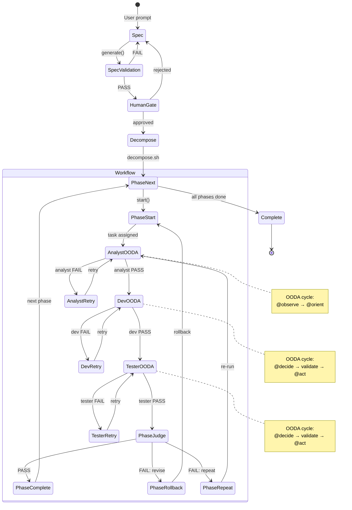

# STATE_FLOW.md — Full Project Lifecycle

**Date:** 2026-07-11  
**Status:** Frozen

---

## 1. High-Level Flow

```
User → Spec → Workflow → Task → OODA → Judge → Workflow → Complete
                          ↑                    │
                          │    FAIL: repeat ───┘
                          │    FAIL: revise ──→ Spec
                          │    FAIL: retask ──→ Workflow
                          └────────────────────┘
```

---

## 2. Mermaid State Diagram



---

## 3. Detailed State Transitions

### 3.1 Spec Phase

| From | To | Trigger | Action |
|------|----|---------|--------|
| `[*]` | `Spec` | User provides prompt | `SpecEngine.generate(prompt)` |
| `Spec` | `SpecValidation` | goals.md generated | `SpecEngine.validate(goals_path)` |
| `SpecValidation` | `Spec` | Validation FAIL | Fix errors, re-validate |
| `SpecValidation` | `HumanGate` | Validation PASS | Present to user |
| `HumanGate` | `Spec` | User rejects | Revise goals.md |
| `HumanGate` | `Decompose` | User approves | `transition.py approve` |

**Events:** `spec.generated`, `spec.validated`, `spec.approved`

---

### 3.2 Decompose Phase

| From | To | Trigger | Action |
|------|----|---------|--------|
| `Decompose` | `PhaseNext` | Decomposition complete | `decompose.sh` creates phases.json |

**Events:** — (handled by shell scripts)

---

### 3.3 Workflow Phase

| From | To | Trigger | Action |
|------|----|---------|--------|
| `PhaseNext` | `PhaseStart` | Next phase ready | `WorkflowEngine.start(phase_id)` |
| `PhaseStart` | `AnalystOODA` | Task assigned | `OODARuntime.execute(task)` |
| `AnalystOODA` | `AnalystRetry` | Agent FAIL | Retry with context |
| `AnalystRetry` | `AnalystOODA` | Retry | Re-run observe/orient |
| `AnalystOODA` | `DevOODA` | Analyst PASS | Hand off to developer |
| `DevOODA` | `DevRetry` | Agent FAIL | Retry with context |
| `DevRetry` | `DevOODA` | Retry | Re-run decide/act |
| `DevOODA` | `TesterOODA` | Dev PASS | Hand off to tester |
| `TesterOODA` | `TesterRetry` | Agent FAIL | Retry with context |
| `TesterRetry` | `TesterOODA` | Retry | Re-run decide/act |
| `TesterOODA` | `PhaseJudge` | Tester PASS | Evaluate results |
| `PhaseJudge` | `PhaseComplete` | Judge PASS | Mark phase complete |
| `PhaseJudge` | `PhaseRepeat` | Judge FAIL: repeat | Re-run current task |
| `PhaseJudge` | `PhaseRollback` | Judge FAIL: revise | Rollback phase |
| `PhaseRepeat` | `AnalystOODA` | Retry | Start OODA again |
| `PhaseRollback` | `PhaseStart` | Rollback | `WorkflowEngine.rollback()` |
| `PhaseComplete` | `PhaseNext` | Phase done | Find next phase |

**Events:** `workflow.started`, `workflow.completed`, `workflow.rollback`, `task.started`, `task.interrupted`, `task.completed`

---

### 3.4 Complete

| From | To | Trigger | Action |
|------|----|---------|--------|
| `PhaseNext` | `Complete` | All phases completed | Show final report |
| `Complete` | `[*]` | Done | — |

---

## 4. Rollback

**Trigger:** Judge Engine returns `FAIL` with `RouteAction.target = "workflow"` and `phase_id` set.

**Flow:**
```
Judge FAIL (revise)
    ↓
RouteAction { target: "workflow", phase_id: "implement-spec", reason: "..." }
    ↓
WorkflowEngine.rollback(phase_id, reason)
    ↓
Phase status → FAILED
Phase tasks → PENDING
    ↓
WorkflowEngine.start(phase_id)  // re-start the phase
    ↓
OODA cycle re-runs with updated context
```

**Invariants:**
- Rollback resets all tasks in the phase to `PENDING`
- Phase status resets to `PENDING`
- `judge_passed` resets to `False`
- Previous outputs are preserved in Memory Layer for context

---

## 5. Retry

**Trigger:** Agent FAIL (timeout, error, incomplete output) or Judge FAIL with `RouteAction.target = "ooda"`.

**Flow:**
```
Agent FAIL / Judge FAIL (repeat)
    ↓
RouteAction { target: "ooda", task_id: "..." }
    ↓
OODARuntime.resume(task_id)
    ↓
Same OODA step re-runs with accumulated context
    ↓
Up to max_retries (default: 3)
    ↓
If still FAIL → escalate to Judge for routing decision
```

**Retry Limits:**

| Agent | Max Retries | Escalation |
|-------|-------------|------------|
| @observe | 3 | → @orient with warnings |
| @orient | 3 | → Judge for re-route |
| @decide | 3 | → Judge for re-route |
| @act | 3 | → Judge for re-route |

**Context preserved between retries:**
- Previous outputs (artifacts)
- Error messages
- Accumulated observations

---

## 6. Interrupt

**Trigger:** User request, timeout, or external signal.

**Flow:**
```
OODARuntime.interrupt(task_id)
    ↓
Task status → BLOCKED
Current agent stops
    ↓
Partial outputs saved to artifacts
    ↓
RuntimeContext.current_task → None
    ↓
WorkflowEngine can:
  - resume(task_id) later
  - rollback(phase_id) if needed
  - reassign task to different agent
```

**Resume after interrupt:**
```
OODARuntime.resume(task_id)
    ↓
Loads partial outputs from artifacts
Continues from last completed step
    ↓
OODA cycle continues
```

---

## 7. Judge Routing Decision Tree

```
Judge.evaluate(response, context, spec)
    ↓
Verdict { overall, scores, failures, confidence }
    ↓
Judge.route(verdict)
    ↓
├── PASS → RouteAction { target: "workflow" }
│         → WorkflowEngine.complete(phase, judge_passed=True)
│
├── PASS_WITH_CONCERNS → RouteAction { target: "workflow" }
│                       → WorkflowEngine.complete(phase, judge_passed=True)
│                       → Log concerns to Memory Layer
│
└── FAIL → RouteAction { target, reason, task_id, phase_id }
          ├── target="ooda"   → OODARuntime.resume(task_id)     [retry]
          ├── target="spec"   → SpecEngine.validate(goals_path) [revise spec]
          └── target="workflow" → WorkflowEngine.rollback(phase_id) [rollback phase]
```

---

## 8. State Machine Summary

| Entity | States | Transitions |
|--------|--------|-------------|
| **Spec** | draft → valid → approved | generate, validate, approve |
| **Phase** | pending → in_progress → completed / failed | start, complete, rollback |
| **Task** | pending → in_progress → completed / blocked / failed | assign, start, complete, interrupt |
| **OODA** | observe → orient → decide → act | execute, resume, interrupt |
| **Judge** | evaluating → scored → routed | evaluate, score, route |

---

## 9. Edge Cases

### Concurrent Phases
- Only one phase is `in_progress` at a time
- `WorkflowEngine.next()` returns the next ready phase only when current is `completed` or `failed`

### Infinite Loop Prevention
- Max retries per task: 3
- Max iterations per phase: 5
- Max total project iterations: 20
- Judge confidence < 0.3 → forced FAIL with escalation

### Partial Completion
- Interrupted tasks save partial artifacts
- Resume continues from last completed OODA step
- Memory Layer preserves all intermediate states

### Spec Drift
- If Judge finds spec inconsistencies during evaluation
- RouteAction.target = "spec" triggers re-validation
- SpecEngine.validate() re-runs against current goals.md
